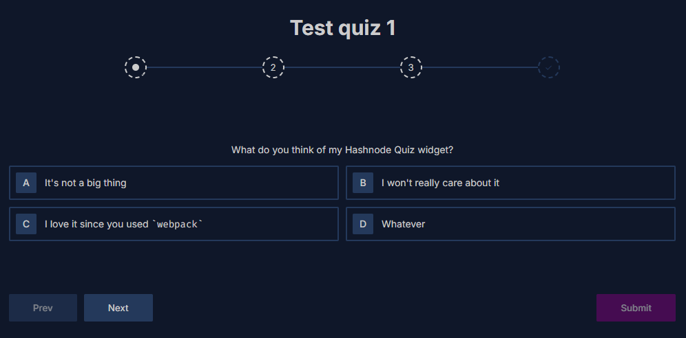
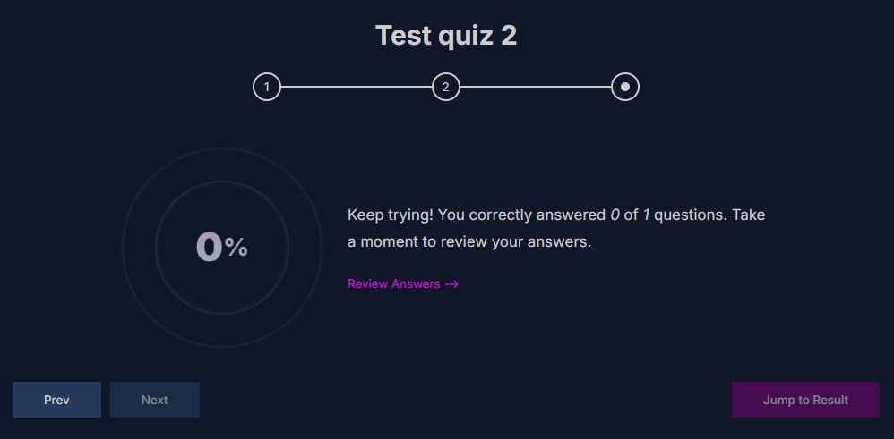
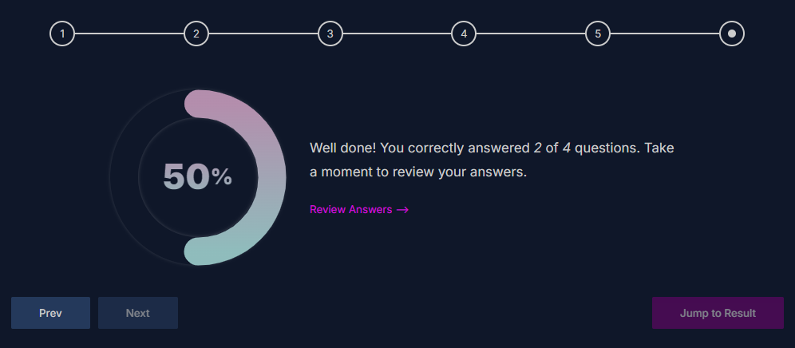

# Quiz UI Library

A customizable library for building pre-styled quiz interfaces. This project
simplifies creating quiz UIs with essential features like keyboard navigation,
progress tracking, and configurable theming.

## Features

- **Keyboard Navigation:**

  - Easily switch between quiz slides using number keys.
  - Shortcuts for switching between questions and results and showing
    explanations.

- **Progress Tracking:**

  - Scrollable progress bar with customizable button states (active, inactive,
    disabled, focused).
  - Progress buttons and slides are accessible as tabs.

- **Custom Theming:**

  - Use your own fonts and theme colors.
  - Easily configurable CSS variables for fine-tuning styles.

- **Quiz Functionality:**

  - Support for unlimited quiz elements with mandatory autosave.
  - Customizable result display, including the ability to skip questions.
  - Granular control over quiz data (supports saving objects).

- **Enhanced Accessibility:**

  - Quiz elements are accessible and responsive across devices.
  - Improved outlines for control elements and focus management.

- **Data Management:**
  - Save and retrieve quiz data using custom objects.
  - Ensure proper data handling and storage.
  - Autosave submission results in browser.

## Planned Enhancements

- **API & Data Handling:**

  - Structured APIs for quiz manipulation.
  - Enhanced autodeletion, shuffling options, and content parsing.

- **Theming:**

  - Complete theming support with granular control over styles and variables.
  - More flexible configuration for theme tokens and animations.

- **Additional Features:**
  - Full documentation and shortcut guides.
  - Improved error handling and validation for input data.
  - Support for importing the library as an npm package.

## Current Status

While the core functionality is implemented and usable, several advanced
features and improvements are yet to be completed. This project is
**incomplete** and provided as-is for reference or further development. I do
plan to do some more work on the project in the future.

## Better API, Docs and TS support to come

The project already fully use TypeScript under the hood. However, as I'm busy
with other stuff at this time, I've yet to fully implement the API surface of
the library and provide TS types. I plan to do those later on (when I get the
time). When it's done, the API surface will be explained in this README.

## Getting Started

You can test out the library locally in very simple steps to see what it does.
It doesn't require any fancy setups. Just do the following:

1. Install the necessary dependencies:
   ```bash
   npm install
   ```
2. Start the development server:
   ```bash
   npm run dev
   ```
3. Open your browser and navigate to
   [http://localhost:8000](http://localhost:8000) to view the application.

This will show a page with quizzes like the ones below. You can test the basic
APIs out by modifying the `src/public/main.js` file and other files in the
`src/public/` directory.




